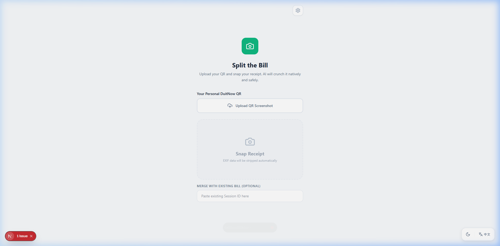
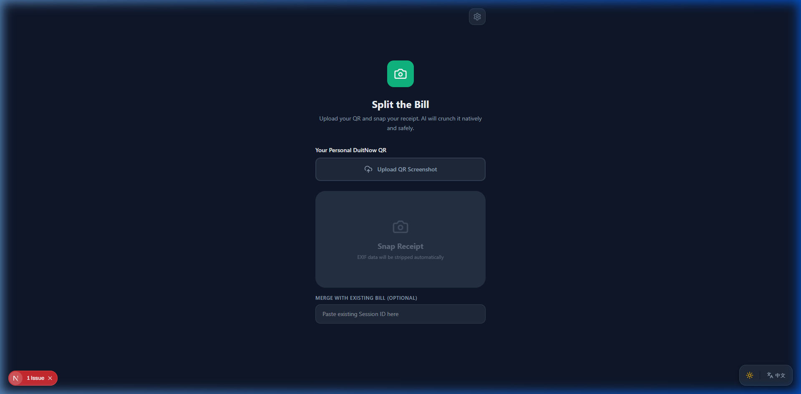
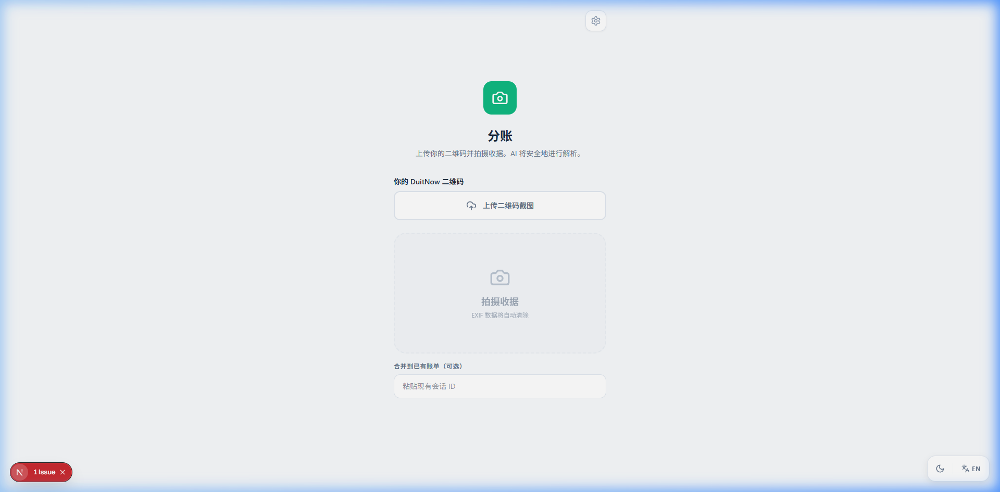
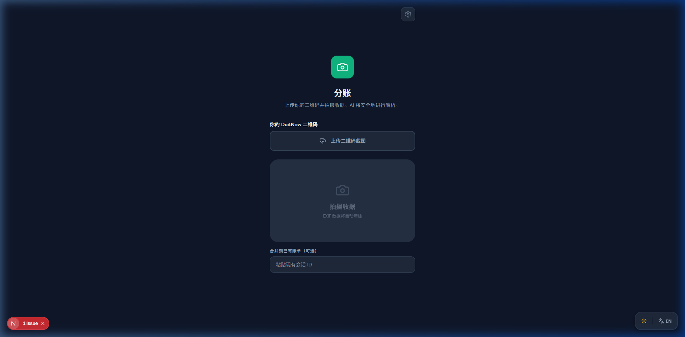

# 🪙 Split-Bill: Zero-Friction Group Settlement

A lightning-fast, privacy-first, and registration-free settlement platform custom-built for the Malaysian market. Split-Bill integrates tightly with Malaysia's **DuitNow QR** ecosystem, allowing a group to organically break down complex restaurant tabs in seconds.

Simply snap a receipt, wait for our AI to extract the line items, and share the session link. Guests tap what they ate, and your live host dashboard tracks the DuitNow payments dynamically!

---

## 🎨 Design System & Mockups

The entire user interface was constructed from scratch utilizing a highly flexible, multi-theme design system. It boasts fully reactive **Dark / Light Modes** alongside instant **English / Simplified Chinese** toggling without reloading.

| Light Mode (English) | Dark Mode (English) |
| :------------------: | :-----------------: |
|  |  |

| Light Mode (Chinese) | Dark Mode (Chinese) |
| :------------------: | :-----------------: |
|  |  |

*(Note: Designs showcase the robust layout, custom CSS properties, and cross-cultural structural integrity).*

---

## 🏗️ Core Architecture & Security

Split-Bill actively abandons traditional heavy-database designs in favor of an **Ephemeral & Stateless Architecture**.

> [!TIP]
> **Zero-Knowledge Token Auth**
> The system tracks sessions using `x-qr-proof` headers. The exact EMVCo string decoded from the host’s physical DuitNow QR is utilized as an invisible authorization token. Guests cannot hijack or maliciously wipe the backend because they lack the raw parsing payload. 

### 1. Atomic Redis Claiming ("Quantum Claim" Prevention)
The core interactions of claiming an item (whether exclusively or splitting it functionally with others) bypass the NodeJS single-thread event loop entirely.
* **Lua Atomicity**: Two sophisticated custom Lua scripts (`CLAIM_LUA` & `SPLIT_CLAIM_LUA`) live inside the Vercel KV store. They natively block race conditions, guaranteeing that 5 people cannot claim the last slice of pizza simultaneously.
* **Mutual Exclusion**: These scripts feature active cross-mode checks blocking *"Quantum Claims"* — preventing an item from being split fractionally and exclusively taken by different actors simultaneously.

### 2. "Ghost Math" Reconciliation Engine
Floating-point math destroys financial integrity. The `src/mathEngine.ts` ensures zero dropped pennies:
* Operates strictly in **Cents/Sen integers**.
* **Fractional Splitting ("Shared Pizza"):** Calculates exact divisions using `Math.floor(price / N)` and sweeps the remaining micro-cents via a systematic **Round-Robin** across claimants currently owing the most.
* Guaranteed 100% downstream reconciliation matching the physical paper receipt.

### 3. Emphatic Ephemeral Stances
> [!IMPORTANT]
> **Data Self-Destruction**
> To protect consumer privacy, the platform uses absolutely no long-term memory. Vercel KV TTLs strictly terminate session JSON blobs, names, partial claims, and uploaded receipt images after exactly **2 Hours (`EX 7200`)**.

---

## ✨ Feature Set

* **Live Command Center:** The Host `/page` mounts a live-polling dashboard showing the settlement progress bar, granular guest names, unallocated debt, and active tracking updates securely.
* **Proportional Tax Allocation:** Changing an item's parsed cost explicitly scales the physical SST (Sales Tax) and Service Charges dynamically without user intervention.
* **Trip Mode (Batch Payment Hub):** Navigating to `/pay` allows guests to merge multiple distinct sessions (across days or venues) and consolidates their micro-debt. It actively reconstructs the EMVCo DuitNow QR to inject a single, massive **Grand Total** payment directly to the host's bank.
* **Privacy-First Receipt Previews:** Opt-in image sharing strictly strips EXIF geo-data and caps image buffer uploads to 500KB to prevent memory exhaustion architectures.
* **Strict EMVCo Parsers:** Blocks arbitrary QR manipulation via strict `000201` header validations using `jsQR`.

---

## 🚀 Getting Started

To run the platform locally, ensure you have an active up-to-date `.env.local` configured with the necessary Redis & AI integrations:

```bash
# Clone and install dependencies
git clone https://github.com/your-org/split-bill
cd split-bill
npm install

# Run the Next.js optimized dev server
npm run dev
```

Visit `http://localhost:3000` to boot up the host flow.
