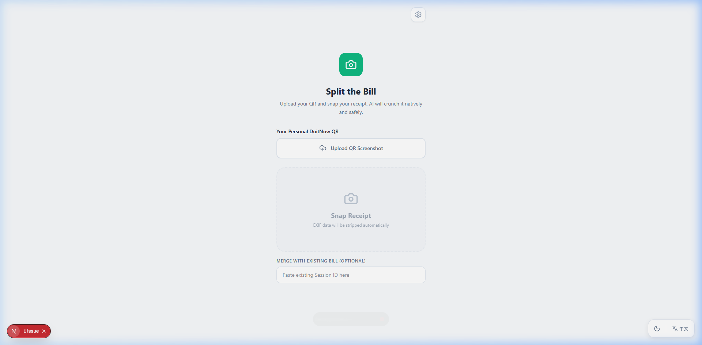
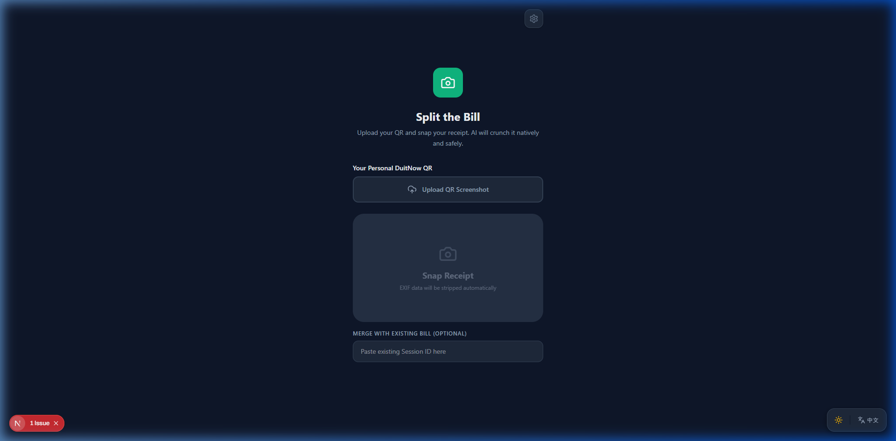
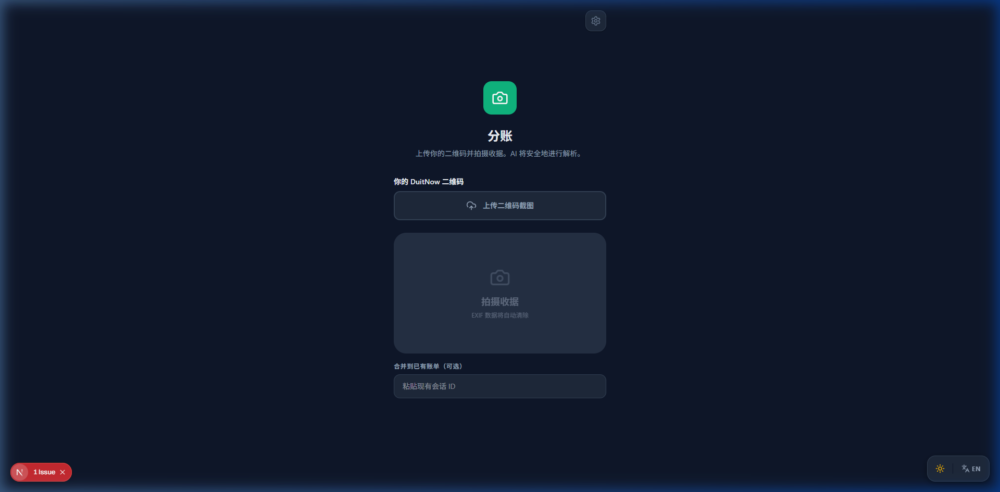

<div align="center">

# SPLIT / BILL

### `SCAN • CLAIM • SETTLE`

**The group bill, without the group spreadsheet.**

<br>


<br><br>

> **Snap the receipt. Let everyone claim what they ate. Pay the exact amount.**
>
> Built around Malaysia's DuitNow QR ecosystem, Split-Bill turns a messy restaurant tab into a live, shared settlement session.

</div>

---

## THE PRODUCT

```text
                 ONE RECEIPT
                      │
                      ▼
                ┌───────────┐
                │ AI PARSER │
                └─────┬─────┘
                      ▼
              ┌───────────────┐
              │ SHARED LEDGER │
              └───────┬───────┘
                      │
          ┌───────────┼───────────┐
          ▼           ▼           ▼
       DANIEL        ALEX        SAM
       ──────        ────        ───
       RM12          RM8         RM17
          \           |          /
           └──────────┼─────────┘
                      ▼
                 EXACT TOTAL
                      │
                      ▼
                  DUITNOW QR
```

The core idea is deliberately simple: **the receipt is the source of truth; the app only determines who owes which part of it.**

---

## THE INTERFACE, PRESERVED

The repository already contains the original Split-Bill UI visuals. They remain part of this README redesign rather than being replaced with new placeholder artwork.

### Light × Dark

| ☀️ Light Mode — English | 🌙 Dark Mode — English |
|:---:|:---:|
|  |  |

### English × 中文

| 🇬🇧 Light Mode — English | 🇨🇳 Light Mode — Chinese |
|:---:|:---:|
|  |  |

| 🇬🇧 Dark Mode — English | 🇨🇳 Dark Mode — Chinese |
|:---:|:---:|
|  |  |

> The four original screenshots are preserved from the existing repository documentation.

---

# 01 / RECEIPT → BILL

The first step is turning an image of a physical receipt into a structured bill.

```text
PHOTO
  ↓
OCR / PARSING
  ↓
LINE ITEMS
  ↓
SUBTOTAL
  ↓
TAX / SERVICE CHARGE
  ↓
FINAL TOTAL
```

The repository contains a dedicated `receiptParser.ts` implementation and accompanying tests.

---

# 02 / CLAIM → OWNERSHIP

Everyone sees the same bill, but each person claims only what they actually consumed.

```text
ITEM
 │
 ├── EXCLUSIVE ─────────► ONE PERSON
 │
 └── SHARED ────────────► MULTIPLE PEOPLE
                              │
                              ▼
                         FRACTIONAL SPLIT
```

The system treats exclusive and shared claims as mutually exclusive states for an item, preventing the same food from being both wholly claimed and fractionally shared.

---

# 03 / THE “QUANTUM CLAIM” PROBLEM

Five users tapping the same item simultaneously should not produce five winners.

A naïve flow:

```text
A ─┐
B ─┤
C ─┼─► READ ─► MODIFY ─► WRITE
D ─┤
E ─┘
```

Split-Bill pushes the critical claim operation into atomic KV/Lua execution:

```text
A ─┐
B ─┤
C ─┼─► ATOMIC LUA ─► ONE VALID STATE
D ─┤
E ─┘
```

This is the key reason the claim engine is designed around atomic operations rather than ordinary application-level read/write sequences.

---

# 04 / SEN-LEVEL ACCOUNTING

Financial arithmetic is handled as integer **sen / cents**, not floating-point currency.

```text
RM 10.00
   ↓
1000 sen
```

For three people sharing RM10.00:

```text
1000 / 3
   ↓
333 + 333 + 333
   ↓
1 sen remainder
   ↓
Systematic allocation
```

The invariant is:

```text
SUM(participant balances)
            =
receipt total
```

That matters much more than making the displayed number look correct.

---

# 05 / TAX FOLLOWS THE FOOD

SST and service charges should not become detached from the items that generated them.

```text
ITEM A ──────┐
ITEM B ──────┼──► BILL TOTAL
ITEM C ──────┘
                  │
                  ├── SST
                  └── SERVICE CHARGE
                           │
                           ▼
                   ALLOCATED TO USERS
```

Changing a parsed item's cost therefore changes its downstream allocation rather than leaving stale tax values behind.

---

# 06 / EPHEMERAL BY DEFAULT

This is a dinner session, not a permanent database record of your social life.

```text
CREATE
  ↓
COLLECT
  ↓
CLAIM
  ↓
SETTLE
  ↓
EXPIRE
```

The current design uses Vercel KV TTLs to expire session data after approximately **2 hours**.

That includes temporary session state such as names, claims and uploaded receipt images.

> **The bill has a lifecycle. The data should too.**

---

# 07 / DUITNOW AS THE LAST MILE

Rather than creating another payment ecosystem, Split-Bill uses the payment rail Malaysians already recognise.

```text
HOST DUITNOW QR
      │
      ▼
EMVCo PARSER
      │
      ▼
PRESERVE MERCHANT DATA
      │
      ▼
INJECT EXACT AMOUNT
      │
      ▼
   FINAL QR
      │
      ▼
EXISTING BANK / WALLET APP
```

The codebase includes a dedicated `duitnowQR.ts` module plus test coverage for QR behaviour.

---

# 08 / LIVE HOST VIEW

The host flow is treated as a settlement console.

```text
┌───────────────────────────────────────────┐
│ DINNER — 6 PEOPLE                         │
├───────────────────────────────────────────┤
│                                           │
│ SETTLEMENT                                │
│ ███████████████████░░░  84%              │
│                                           │
│ CLAIMED                     RM 86.40      │
│ REMAINING                   RM 16.20      │
│                                           │
│ ✓ Daniel                                  │
│ ✓ Aidan                                   │
│ ✓ Sean                                    │
│ ◐ Guest 04                                │
│ ○ Guest 05                                │
│                                           │
│              [ SHOW QR ]                  │
└───────────────────────────────────────────┘
```

The repository includes a live host page that tracks claim and settlement progress.

---

# 09 / TRIP MODE

A weekend does not have one receipt.

```text
Friday Dinner     RM 42.80
Saturday Brunch   RM 18.50
Saturday Dinner   RM 67.30
Sunday Cafe       RM 11.20
                    ──────
Trip Total        RM139.80
```

Trip Mode allows multiple settlement sessions to be combined into a single payment flow and reconstructs a final DuitNow QR for the consolidated amount.

---

# 10 / PRIVACY GUARDRAILS

Temporary receipt media is handled with explicit limits.

```text
UPLOAD
  │
  ├── size limit
  ├── metadata stripping
  └── temporary storage
```

The project design also validates DuitNow input using EMVCo structure checks rather than trusting arbitrary QR strings.

---

# 11 / DESIGN SYSTEM

The UI was built with a custom theme system supporting:

```text
LIGHT MODE  ◐  DARK MODE

ENGLISH     ◐  简体中文
```

Theme switching and language switching are implemented as application-level systems rather than separate static pages.

---

# 12 / ARCHITECTURE

```text
                   ┌───────────────────┐
                   │     NEXT.JS       │
                   │   React + TS      │
                   └─────────┬─────────┘
                             │
          ┌──────────────────┼──────────────────┐
          ▼                  ▼                  ▼
   Receipt Parser       Claim Engine       Payment Engine
          │                  │                  │
          │            ┌─────┴─────┐            │
          │            ▼           ▼            │
          │         EXCLUSIVE    SHARED         │
          │            │           │            │
          └────────────┴─────┬─────┴────────────┘
                              ▼
                         VERCEL KV
                              │
                         EPHEMERAL
                           STATE
```

---

# 13 / STACK

| Layer | Technology |
|---|---|
| Framework | **Next.js 15** |
| Frontend | **React 19** |
| Language | **TypeScript 5** |
| Styling | **Tailwind CSS 4** |
| Storage | **Vercel KV** |
| QR decoding | **jsQR** |
| QR generation | **qrcode.react** |
| Validation | **Zod** |
| Icons | **Lucide React** |
| Testing | **Vitest** |

These dependencies are reflected in the repository's package manifest.

---

# 14 / SOURCE MAP

```text
split-bill/
│
├── app/
│   └── application routes / UI flows
│
├── src/
│   ├── receiptParser.ts
│   ├── duitnowQR.ts
│   ├── mathEngine.ts
│   ├── privacy.ts
│   ├── rateLimit.ts
│   ├── ThemeContext.tsx
│   ├── i18n.ts
│   └── *.test.ts
│
├── public/
│   └── docs/
│       ├── default_light_english_1774798917799.png
│       ├── dark_mode_english_1774798931920.png
│       ├── light_mode_chinese_1774798959449.png
│       └── dark_mode_chinese_1774798949185.png
│
├── constraints.md
├── package.json
└── README.md
```

---

# 15 / RUN

```bash
git clone https://github.com/DanielKoh2004/split-bill.git
cd split-bill
npm install
npm run dev
```

Open:

```text
http://localhost:3000
```

Tests:

```bash
npm test
```

Production build:

```bash
npm run build
npm start
```

Configure the required `.env.local` values for the Vercel KV and receipt/AI integrations before running the full application.

---

# 16 / WHY THIS PROJECT IS INTERESTING

This is not fundamentally a calculator.

It is a small distributed-systems problem hiding behind a restaurant receipt.

```text
          USER EXPERIENCE
                 │
                 ▼
        "Who owes how much?"
                 │
        ┌────────┼────────┐
        ▼        ▼        ▼
      PARSE    CONCUR    RECONCILE
        │        │        │
        ▼        ▼        ▼
      OCR      ATOMIC   INTEGER
               CLAIMS     MATH
        │        │        │
        └────────┼────────┘
                 ▼
             SETTLEMENT
```

The difficult parts are not the buttons.

They are **concurrency, financial correctness, payment interoperability, and privacy**.

---

# 17 / THE PRODUCT IN ONE FRAME

```text
┌───────────────────────────────────────────────────────────┐
│                                                           │
│  📸  RECEIPT                                              │
│       ↓                                                   │
│  🧾  STRUCTURE                                            │
│       ↓                                                   │
│  👥  CLAIM                                                │
│       ↓                                                   │
│  🧮  RECONCILE                                            │
│       ↓                                                   │
│  🇲🇾  DUITNOW                                              │
│       ↓                                                   │
│  ✅  DONE                                                  │
│                                                           │
│            SPLIT THE BILL. NOT THE FRIENDSHIP.            │
│                                                           │
└───────────────────────────────────────────────────────────┘
```

<div align="center">

<br>

**Split-Bill** · Group settlement for the real world

[View Repository →](https://github.com/DanielKoh2004/split-bill)

</div>
